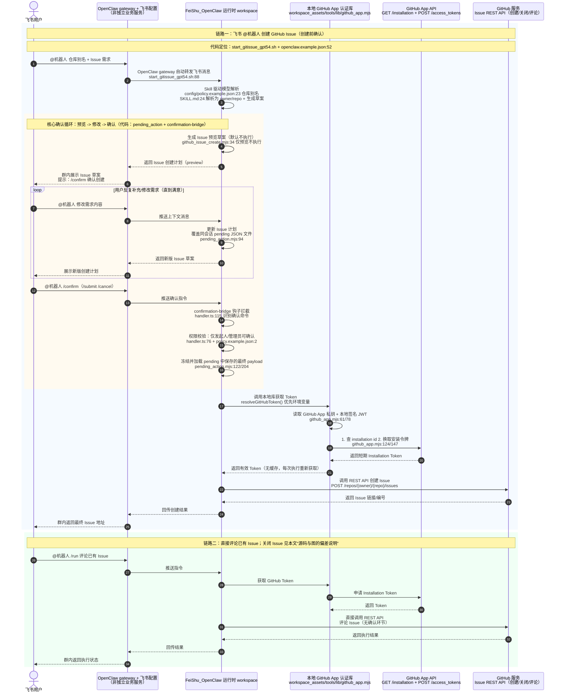

# GitHub Issue 机器人实现交接

## 一图总览

## 先给接手人一个总判断

第一优先要理解的，不是飞书接入本身，而是“创建 Issue 这条确认链路”到底靠什么成立。当前实现的核心不是 `gh auth login`，也不是 GitHub webhook，而是下面 5 个增量能力叠在一起后，才把最基础的飞书 OpenClaw 变成了 GitHub Issue 机器人：

- 专用实例和专用 workspace
- 本地 GitHub App 鉴权库
- `create / close / comment` 三个本地 Issue 工具
- `pending_action` 待确认状态机
- `confirmation-bridge` 飞书确认钩子

第二优先要理解的是，这套实现里“初始用户意图识别”仍然主要是 skill 驱动的模型行为，不是代码硬路由。也就是说，它在“明确说要创建/关闭/comment issue”时表现还可以，但对模糊表达并不稳。

第三优先要明确的是，图里“链路二：直接评论/关闭已有 Issue（无需确认循环）”与当前源码并不完全一致：

- 直接评论已有 Issue：成立
- 直接关闭已有 Issue：不成立
- 当前源码里，关闭 Issue 仍然走 `preview -> pending -> /confirm` 这套确认闭环

对应源码位置：

- `/root/code/bot/example/example_feishuGitIssue/workspace_assets/skills/github-issue-tool/SKILL.md:32-38`
- `/root/code/bot/example/example_feishuGitIssue/workspace_assets/tools/github_issue_close.mjs:20-57`
- `/root/code/bot/example/example_feishuGitIssue/workspace_assets/tools/pending_action.mjs:122-128`

## 相比最基础飞书 OpenClaw，实质上新增了什么

### 1. 专用实例与专用 workspace

这一步解决的是“它为什么不是一个通用聊天机器人，而是一个 GitHub Issue 专用机器人”。

源码位置：

- `/root/code/bot/example/example_feishuGitIssue/openclaw.example.json:28-37`
- `/root/code/bot/example/example_feishuGitIssue/start_gitissue_gpt54.sh:4-13`
- `/root/code/bot/example/example_feishuGitIssue/start_gitissue_gpt54.sh:85-89`
- `/root/code/bot/example/example_feishuGitIssue/scripts/sync_to_feishu_workspace.sh:7-22`
- `/root/code/bot/example/example_feishuGitIssue/.openclaw-feishu-gitissue-gpt54/workspace-larkbot/AGENTS.md:3-22`

实现说明：

- `openclaw.example.json` 把默认 workspace 固定到了 `example_feishuGitIssue/.openclaw-feishu-gitissue-gpt54/workspace-larkbot`。
- `start_gitissue_gpt54.sh` 把实例目录、状态目录、日志、PID、端口、GitHub env 文件都固定到同一个示例目录下。
- `scripts/sync_to_feishu_workspace.sh` 会把仓库里的 `workspace_assets/` 同步到运行时 workspace，因此运行时看到的 skill、hook、tool 都是这个 Issue 机器人自己的，而不是 OpenClaw 的通用默认内容。

### 2. 本地 GitHub App 鉴权库

这一步解决的是“机器人为什么不用 `gh auth login` 也能真正写 GitHub”。

源码位置：

- `/root/code/bot/example/example_feishuGitIssue/workspace_assets/tools/lib/github_app.mjs:11-59`
- `/root/code/bot/example/example_feishuGitIssue/workspace_assets/tools/lib/github_app.mjs:61-76`
- `/root/code/bot/example/example_feishuGitIssue/workspace_assets/tools/lib/github_app.mjs:124-175`
- `/root/code/bot/example/example_feishuGitIssue/workspace_assets/tools/lib/github_app.mjs:177-219`
- `/root/code/bot/example/example_feishuGitIssue/start_gitissue_gpt54.sh:30-42`

实现说明：

- `loadGitHubAppConfigEnv()` 会读取 `/root/.config/openclaw/github-app/config.env`，并兼容旧变量名。
- `readPrivateKey()` 同时支持两种输入：直接 PEM 文本，或 PEM 文件路径。
- `createAppJwt()` 负责用私钥在本地签 JWT。
- `resolveInstallationId()` 会在没显式给 installation id 时，按 `owner/repo` 去查 `GET /repos/{owner}/{repo}/installation`。
- `createInstallationAccessToken()` 再调用 `POST /app/installations/{id}/access_tokens` 获取 Installation Token。
- `resolveGitHubToken()` 先看环境里有没有直接 token，没有才走 GitHub App 交换流程。
- 当前没有 installation token 缓存，每次执行真实 GitHub 操作都会重新换一次 token。

### 3. 本地 Issue 工具，而不是 `gh` CLI

这一步解决的是“模型真正落 GitHub 副作用时，执行出口在哪”。

源码位置：

- `/root/code/bot/example/example_feishuGitIssue/workspace_assets/tools/github_issue_create.mjs`
- `/root/code/bot/example/example_feishuGitIssue/workspace_assets/tools/github_issue_close.mjs`
- `/root/code/bot/example/example_feishuGitIssue/workspace_assets/tools/github_issue_comment.mjs`

实现说明：

- `github_issue_create.mjs` 负责创建 issue。`--execute` 缺失时只返回 preview payload，`--execute` 存在时才调用 GitHub REST API。
- `github_issue_close.mjs` 负责关闭 issue。当前也支持 preview，默认并不会直接关闭。
- `github_issue_comment.mjs` 负责给已有 issue 追加评论，支持直接传 `--issueUrl`，用于 `/run` 这种显式评论动作。

### 4. `pending_action` 待确认状态机

这一步是当前最核心的安全垫。没有它，机器人就只是“模型说了算”；有了它，才有真正的“预览、确认、执行”分离。

源码位置：

- `/root/code/bot/example/example_feishuGitIssue/workspace_assets/tools/pending_action.mjs:21-27`
- `/root/code/bot/example/example_feishuGitIssue/workspace_assets/tools/pending_action.mjs:94-120`
- `/root/code/bot/example/example_feishuGitIssue/workspace_assets/tools/pending_action.mjs:122-146`
- `/root/code/bot/example/example_feishuGitIssue/workspace_assets/tools/pending_action.mjs:153-177`
- `/root/code/bot/example/example_feishuGitIssue/workspace_assets/tools/pending_action.mjs:204-247`

实现说明：

- pending 文件按“会话 scope”落到 `state/pending-actions/` 目录。
- 同一个飞书会话里，新的 preview 会覆盖同一个 scope 对应的 pending JSON 文件。
- `action=create` 只保存即将执行的动作和参数，不做任何外部写操作。
- `action=execute` 才会把 pending 中的 `kind` 映射为真正的工具，例如 `github_issue_create` -> `github_issue_create.mjs`。
- 当前 `toolByKind` 只支持 `github_issue_create` 和 `github_issue_close`，comment 不走 pending。

### 5. `confirmation-bridge` 飞书确认钩子

这一步解决的是“/confirm 为什么真的能落代码，不是只靠 prompt 识别”。

源码位置：

- `/root/code/bot/example/example_feishuGitIssue/workspace_assets/hooks/confirmation-bridge/handler.ts:38-41`
- `/root/code/bot/example/example_feishuGitIssue/workspace_assets/hooks/confirmation-bridge/handler.ts:57-74`
- `/root/code/bot/example/example_feishuGitIssue/workspace_assets/hooks/confirmation-bridge/handler.ts:76-98`
- `/root/code/bot/example/example_feishuGitIssue/workspace_assets/hooks/confirmation-bridge/handler.ts:115-190`
- `/root/code/bot/example/example_feishuGitIssue/config/policy.example.json:2-29`

实现说明：

- 这个 hook 只拦飞书 `message received` 事件。
- 它会把文本归一化后匹配 `confirmCommands` / `cancelCommands`。
- 只有发起人本人或 `policy.admins` 里的管理员，才能确认或取消。
- 真正执行时，它不会自己直接调 GitHub，而是再次调用 `pending_action.mjs --action execute`，让执行出口保持统一。

## 按图展开：链路一“飞书 @机器人 创建 GitHub Issue（创建前确认）”

### 步骤 1：飞书消息入口

源码位置：

- `/root/code/bot/example/example_feishuGitIssue/openclaw.example.json:52-87`
- `/root/code/bot/example/example_feishuGitIssue/start_gitissue_gpt54.sh:88-89`

实现逻辑：

- `openclaw.example.json` 定义了 Feishu channel 配置、allowlist 群、`requireMention=true` 等基础接入规则。
- `start_gitissue_gpt54.sh` 实际执行 `openclaw gateway run --port 18890`，因此飞书消息不是进一个你自建的业务 webhook，而是由 OpenClaw gateway 直接接住并转发到当前 workspace。

### 步骤 2：仓库解析和 Issue 草案生成

源码位置：

- `/root/code/bot/example/example_feishuGitIssue/config/policy.example.json:23-29`
- `/root/code/bot/example/example_feishuGitIssue/workspace_assets/skills/github-issue-tool/SKILL.md:9-30`
- `/root/code/bot/example/example_feishuGitIssue/.openclaw-feishu-gitissue-gpt54/workspace-larkbot/AGENTS.md:13-22`

实现逻辑：

- `policy.example.json` 提供 `repoAliases`，例如 `robot -> yeying-community/robot`。
- `github-issue-tool` skill 告诉模型：遇到 issue 请求时，先解析 owner/repo，再生成标题、正文、标签、负责人等草案。
- `AGENTS.md` 再进一步把这件事固定成当前 workspace 的主工作流。

这里要特别强调：这一步不是代码硬路由，而是“skill 驱动 + 模型解析”。因此它的优点是改提示快，缺点是初始意图识别不够 deterministic。

### 步骤 3：生成预览，不直接创建

源码位置：

- `/root/code/bot/example/example_feishuGitIssue/workspace_assets/tools/github_issue_create.mjs:8-44`

实现逻辑：

- `execute` 默认是 `false`。
- 在 `!execute` 分支里，工具只返回 `owner/repo/payload` 这一份结构化 preview。
- 也就是说，草案生成阶段并不会向 GitHub 发 `POST /issues`。

### 步骤 4：把预览冻结成 pending，支持反复修改

源码位置：

- `/root/code/bot/example/example_feishuGitIssue/workspace_assets/tools/pending_action.mjs:94-120`
- `/root/code/bot/example/example_feishuGitIssue/workspace_assets/tools/pending_action.mjs:153-177`

实现逻辑：

- pending 文件名由 `channelId + accountId + conversationId` 做 base64url 编码得到。
- 所以同一个飞书群会话里，新的 preview 会写回同一个 pending 文件。
- 这就是“用户反复补充/修改需求，直到满意”的代码基础：并不是在内存里瞎记，而是明确覆盖同会话对应的 pending JSON。

### 步骤 5：用户 `/confirm`，hook 接管执行

源码位置：

- `/root/code/bot/example/example_feishuGitIssue/workspace_assets/hooks/confirmation-bridge/handler.ts:115-190`
- `/root/code/bot/example/example_feishuGitIssue/workspace_assets/hooks/confirmation-bridge/handler.ts:76-98`
- `/root/code/bot/example/example_feishuGitIssue/config/policy.example.json:2-15`

实现逻辑：

- hook 先判断当前消息是不是飞书收到的消息。
- 再把文本和 `confirmCommands` / `cancelCommands` 做匹配。
- 再做权限校验：只有原发起人或管理员可以确认。
- 然后读取当前会话的 pending，并触发 `pending_action.mjs --action execute`。

需要注意一个实现细节：如果当前会话没有 pending，`handler.ts:148-152` 会直接静默返回，不会给用户提示。这是一个已知 UX 缺口。

### 步骤 6：GitHub App 认证

源码位置：

- `/root/code/bot/example/example_feishuGitIssue/workspace_assets/tools/lib/github_app.mjs:61-90`
- `/root/code/bot/example/example_feishuGitIssue/workspace_assets/tools/lib/github_app.mjs:124-175`
- `/root/code/bot/example/example_feishuGitIssue/workspace_assets/tools/lib/github_app.mjs:177-219`
- `/root/code/bot/example/example_feishuGitIssue/start_gitissue_gpt54.sh:30-42`

实现逻辑：

- 工具层先尝试读直给的 `GITHUB_TOKEN/GH_TOKEN`。
- 如果没有，才读取 GitHub App 配置、私钥、installation id 或 `owner/repo`。
- 然后用私钥本地签 JWT，先调 `GET /repos/{owner}/{repo}/installation` 反查 installation，再调 `POST /app/installations/{id}/access_tokens` 换安装令牌。
- 当前没有 token 缓存，因此每次真实执行 create/close/comment 都会重新换 token。

### 步骤 7：真正调用 GitHub REST API 创建 Issue

源码位置：

- `/root/code/bot/example/example_feishuGitIssue/workspace_assets/tools/github_issue_create.mjs:46-97`

实现逻辑：

- 只有在 `--execute` 为真时，才会调用 `resolveGitHubToken()`。
- 然后向 `POST https://api.github.com/repos/{owner}/{repo}/issues` 发请求。
- 成功后只回传最小结果集：`number`、`title`、`state`、`htmlUrl`，方便上层把结果回贴到飞书。

### 链路一的实机证据

下面这两段会话日志能证明“预览 -> pending -> /confirm -> 真创建”这条链已经在现网跑通过：

- 预览并写入 pending：
  - `/root/code/bot/example/example_feishuGitIssue/.openclaw-feishu-gitissue-gpt54/state/agents/main/sessions/959c349f-1f7b-429a-8e59-943f3071d3ce.jsonl.comment-reset.bak:23-27`
- `/confirm` 后真正创建 `Issue #18`：
  - `/root/code/bot/example/example_feishuGitIssue/.openclaw-feishu-gitissue-gpt54/state/agents/main/sessions/959c349f-1f7b-429a-8e59-943f3071d3ce.jsonl.comment-reset.bak:30-31`

## 按图展开：链路二“直接评论已有 Issue”

### 直接评论 `/run` 为什么可以不走确认

源码位置：

- `/root/code/bot/example/example_feishuGitIssue/workspace_assets/skills/github-issue-tool/SKILL.md:47-61`
- `/root/code/bot/example/example_feishuGitIssue/.openclaw-feishu-gitissue-gpt54/workspace-larkbot/AGENTS.md:22`
- `/root/code/bot/example/example_feishuGitIssue/workspace_assets/tools/github_issue_comment.mjs:6-17`
- `/root/code/bot/example/example_feishuGitIssue/workspace_assets/tools/github_issue_comment.mjs:69-121`

实现逻辑：

- skill 明确规定：如果用户已经显式指定 issue 和评论内容，就直接执行本地 comment 工具，不要走 `gh` CLI。
- `github_issue_comment.mjs` 支持从完整 issue URL 里反解 `owner/repo/issueNumber`。
- 该工具会直接向 `POST /repos/{owner}/{repo}/issues/{issueNumber}/comments` 发请求。

实机证据：

- `/root/code/bot/example/example_feishuGitIssue/.openclaw-feishu-gitissue-gpt54/state/agents/main/sessions/071306c8-eae8-413c-a6c3-23ce22d9d646.jsonl:8-10`

这段日志里已经能看到它成功在 `Issue #17` 下评论了 `/run`。

## 源码与图的偏差说明

这里必须单独说清楚，因为这对交接最重要。

### 偏差 1：图里“关闭已有 Issue 无需确认”，但当前源码不是这样

源码位置：

- `/root/code/bot/example/example_feishuGitIssue/workspace_assets/skills/github-issue-tool/SKILL.md:32-38`
- `/root/code/bot/example/example_feishuGitIssue/workspace_assets/tools/github_issue_close.mjs:20-57`
- `/root/code/bot/example/example_feishuGitIssue/workspace_assets/tools/pending_action.mjs:125-128`

真实情况：

- `close` 和 `create` 一样，默认先 preview。
- 真正关闭 issue 仍然要经过 `pending_action` 和 `/confirm`。
- 所以当前源码并不支持“用户一句话就直接关闭 issue”。

实机证据：

- `/root/code/bot/example/example_feishuGitIssue/.openclaw-feishu-gitissue-gpt54/state/agents/main/sessions/e5971aca-20ea-47ee-b708-292edcbb27ff.jsonl:27`

这条日志能看到 `Issue #18` 是通过 execute 链路成功关闭的，但它背后仍然属于 pending/confirm 体系，不是 comment 那种直执行。

### 偏差 2：图里“解析逻辑”看起来像代码硬编码，但当前其实主要是模型驱动

源码位置：

- `/root/code/bot/example/example_feishuGitIssue/workspace_assets/hooks/confirmation-bridge/handler.ts:115-130`
- `/root/code/bot/example/example_feishuGitIssue/.openclaw-feishu-gitissue-gpt54/workspace-larkbot/AGENTS.md:13-22`
- `/root/code/bot/example/example_feishuGitIssue/workspace_assets/skills/github-issue-tool/SKILL.md:9-15`

真实情况：

- `confirmation-bridge` 只负责识别 `/confirm`、`/submit`、`/cancel`。
- 普通“帮我提个 issue”“这个文档要补一下”这类初始请求，并没有代码级 deterministic router。
- 它主要依赖模型读 `AGENTS.md` 和 `SKILL.md` 后，自主判断要不要走 issue 工具链。

这就是为什么当前有一个很明显的问题：如果用户没有在 `@` 时说出 `issue` 之类关键词，或者说法太像普通聊天，机器人就可能完全没有切进 issue 工作流，而且连个提示都不给。

## 当前实现最不严谨、最值得优先改的地方

### 1. 初始意图识别不是代码硬路由

源码位置：

- `/root/code/bot/example/example_feishuGitIssue/.openclaw-feishu-gitissue-gpt54/workspace-larkbot/AGENTS.md:13-22`
- `/root/code/bot/example/example_feishuGitIssue/workspace_assets/skills/github-issue-tool/SKILL.md:9-15`
- `/root/code/bot/example/example_feishuGitIssue/workspace_assets/hooks/confirmation-bridge/handler.ts:115-130`

问题本质：

- 现在“是不是要进入 issue 机器人流程”主要靠模型自己判断。
- 这导致它更像“一个被约束过的通用聊天机器人”，而不是“一个有代码路由兜底的 issue 业务机器人”。
- 这也是当前最影响用户感知的问题。

### 2. 还没有 GitHub 入站事件链路

源码位置：

- `/root/code/bot/example/example_feishuGitIssue/README.md:5-16`
- `/root/code/bot/example/example_feishuGitIssue/README.md:37-40`

问题本质：

- 当前只有“飞书入站 + GitHub 出站”。
- 没有 GitHub webhook consumer，也没有 comment 轮询器。
- 所以“代码机器人评论 `/submit` -> issue 机器人自动感知并关闭”这条链路，目前不是已实现功能，只是后续目标。

### 3. `comment` 不走 pending，`close` 才走 pending

源码位置：

- `/root/code/bot/example/example_feishuGitIssue/workspace_assets/tools/pending_action.mjs:122-128`
- `/root/code/bot/example/example_feishuGitIssue/workspace_assets/tools/github_issue_comment.mjs:69-121`

问题本质：

- 当前 `pending_action` 只覆盖 create 和 close。
- 这意味着 `/run` 评论类动作可以直接落 GitHub，没有确认闭环。
- 对联调场景这很方便，但对生产场景是否足够严谨，需要后续再判断。

### 4. `/confirm` 在没有 pending 时会静默返回

源码位置：

- `/root/code/bot/example/example_feishuGitIssue/workspace_assets/hooks/confirmation-bridge/handler.ts:148-152`

问题本质：

- 如果用户发了 `/confirm`，但当前会话没有 pending，机器人不会解释原因。
- 这会让用户感觉像“机器人没反应”。
- 从排障角度看，这一条也会增加沟通成本。

### 5. GitHub App token 每次都现换，没有缓存

源码位置：

- `/root/code/bot/example/example_feishuGitIssue/workspace_assets/tools/lib/github_app.mjs:177-219`

问题本质：

- 正确性没问题，但工程化程度不高。
- 每次真实执行都要重新换 installation token。
- 如果后续调用频率上来，可能要补 token 缓存、重试和更清晰的日志观测。

## 接手建议：阅读顺序

如果后续同学只够花 30 分钟理解现状，建议按下面顺序看源码：

1. `/root/code/bot/example/example_feishuGitIssue/workspace_assets/tools/lib/github_app.mjs`
2. `/root/code/bot/example/example_feishuGitIssue/workspace_assets/tools/pending_action.mjs`
3. `/root/code/bot/example/example_feishuGitIssue/workspace_assets/hooks/confirmation-bridge/handler.ts`
4. `/root/code/bot/example/example_feishuGitIssue/workspace_assets/tools/github_issue_create.mjs`
5. `/root/code/bot/example/example_feishuGitIssue/workspace_assets/tools/github_issue_close.mjs`
6. `/root/code/bot/example/example_feishuGitIssue/workspace_assets/tools/github_issue_comment.mjs`
7. `/root/code/bot/example/example_feishuGitIssue/workspace_assets/skills/github-issue-tool/SKILL.md`
8. `/root/code/bot/example/example_feishuGitIssue/.openclaw-feishu-gitissue-gpt54/workspace-larkbot/AGENTS.md`

原因很直接：

- `github_app.mjs` 是 GitHub 写权限的根。
- `pending_action.mjs` 是确认闭环的根。
- `handler.ts` 是飞书确认命令真正落地的根。
- create/close/comment 三个工具是所有外部副作用的真正出口。
- `SKILL.md` 和 `AGENTS.md` 则解释了：为什么这个机器人有时能像 issue 机器人，有时又会像通用聊天机器人。

## 一句话总结

当前这套实现，本质上不是一个“代码硬路由的 GitHub Issue 网关”，而是一个“被专门约束过的 OpenClaw workspace + 本地 GitHub App 工具链”。

它已经足够支撑“飞书里预览后创建 Issue”“飞书里确认后关闭 Issue”“对明确目标 Issue 直接评论 `/run`”这三件事；但它最关键的短板也很明确：初始用户意图识别仍然太依赖模型，不够像一个真正严格的 Issue 业务机器人。