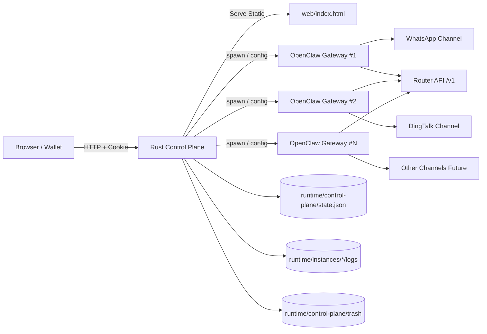
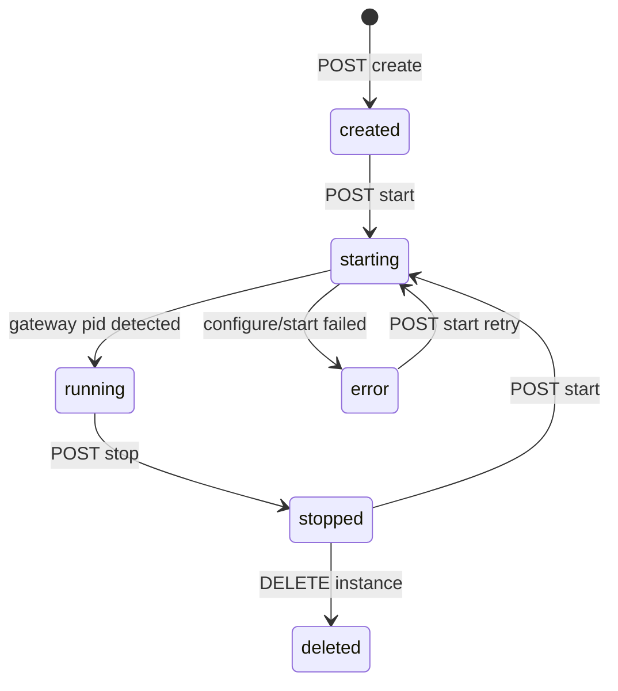
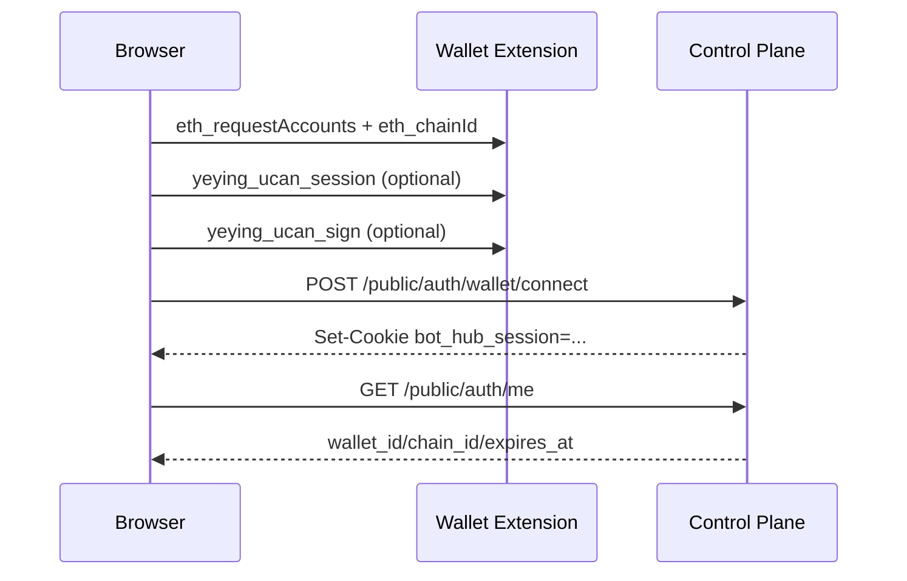
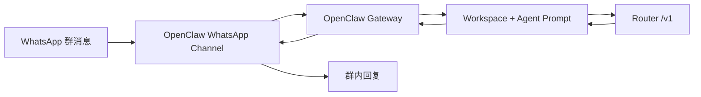
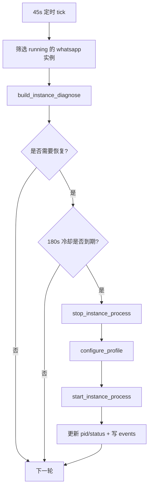
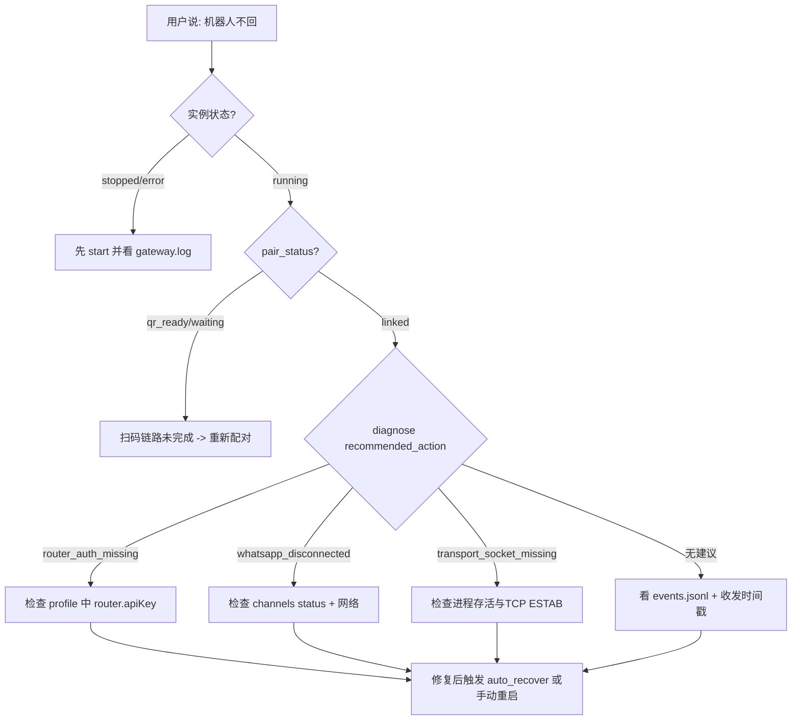

# Bot Hub 控制平面详细设计文档

> 版本：2026-03-18  
> 仓库：`/home/administrator/code/bot_hub`  
> 重点对象：Rust `control-plane`（Bot 平面）+ OpenClaw 多实例编排

## 1. 战报结论（先看这 90 秒）

Bot Hub 当前已经形成一套可运行的“机器人控制平面”：

- 一个 Rust 进程统一提供 Web UI + API。
- 一个实例 = 一套独立 OpenClaw profile + 独立端口 + 独立目录。
- WhatsApp / DingTalk 可并行运行，实例之间互不覆盖配置。
- 控制平面内置诊断与自动恢复（针对 WhatsApp 链路）。
- 交付侧已有标准化启动与打包脚本：`scripts/starter.sh`、`scripts/package.sh`。

一句话定义本系统：

**它不是“机器人本体”，而是“起机器人、管机器人、保机器人”的总控层。**

---

## 2. 设计目标与非目标

### 2.1 设计目标

1. 让新同学在一个页面内完成：登录、建实例、启动、配对、看日志、排障。
2. 保证多机器人并行时的隔离性：配置隔离、运行隔离、目录隔离。
3. 统一模型配置入口（Router + 默认模型 + allowlist）。
4. 把“偶发断线”从人工盯盘升级为“可观测 + 可恢复”。

### 2.2 非目标（当前版本）

1. 不负责机器人业务推理策略本身（那是 OpenClaw workspace/agents 的职责）。
2. 不负责 UCAN 在后端的强校验闭环（当前只存会话载荷，未验签）。
3. 不提供关系型数据库高可用方案（当前使用文件状态）。

---

## 3. 总体架构（系统地图）



### 3.1 分层说明

1. **交互层**：`rust/control-plane/web/index.html`，负责页面交互与轮询。
2. **控制层**：`rust/control-plane/src/main.rs`，负责 API、编排、状态机、自愈。
3. **执行层**：`openclaw --profile hub-xxx ...`，真正跑 channel 与 agent。
4. **外部依赖层**：Router API、WhatsApp/DingTalk 网络、钱包扩展。

---

## 4. 仓库关键目录（控制平面视角）

```text
bot_hub/
├─ rust/control-plane/
│  ├─ src/main.rs                  # 控制平面核心逻辑（单文件 MVP）
│  ├─ web/index.html               # Web UI（纯静态）
│  └─ .env.example                 # 运行环境模板
├─ runtime/
│  ├─ control-plane/state.json     # 实例状态持久化文件
│  ├─ control-plane/logs/          # 控制平面日志
│  └─ instances/<id>/              # 每个实例的独立目录
│     ├─ config/
│     ├─ state/
│     ├─ workspace/                # AGENTS/SOUL/USER 模板
│     └─ logs/                     # gateway.log / pair.log / events.jsonl
├─ scripts/
│  ├─ starter.sh                   # 标准启动/停止/重启
│  └─ package.sh                   # 标准打包（含 tag 规则）
└─ docs/
   └─ bot-hub-control-plane-detailed-design.md
```

---

## 5. 运行时核心设计

### 5.1 内存状态与持久化状态

`AppState` 内包含四类关键状态：

1. `db: DbState`：实例列表 + 默认模型（会持久化到 `state.json`）。
2. `sessions: HashMap`：钱包会话（仅内存，进程重启会丢失）。
3. `heal_marks: HashMap`：自动恢复冷却标记（仅内存）。
4. `http: reqwest::Client`：调用 Router `/models`。

### 5.2 配置来源

`load_static_config()` 从环境变量读取：

- 服务：`BOT_HUB_BIND_ADDR`
- 目录：`BOT_HUB_REPO_ROOT / BOT_HUB_RUNTIME_DIR / BOT_HUB_INSTANCES_ROOT`
- 模型：`ROUTER_BASE_URL / ROUTER_API_KEY / BOT_HUB_DEFAULT_MODEL / BOT_HUB_MODEL_ALLOWLIST`
- 安全：`BOT_HUB_ADMIN_TOKEN / BOT_HUB_INTERNAL_TOKEN`
- 资源：端口范围与 session TTL

### 5.3 实例隔离策略（核心）

创建实例时生成：

- 独立实例 ID：`<name-slug>-<6位随机>`
- 独立 profile：`hub-<instance-id>`
- 独立端口：从 `18800~18999` 自动分配
- 独立目录：`runtime/instances/<id>/...`

这四个维度共同保证了“多实例互不影响”。

---

## 6. 生命周期设计（实例状态机）



状态说明：

1. `created`：仅完成元数据和目录准备。
2. `starting`：正在写 profile 并拉起 openclaw gateway。
3. `running`：检测到有效 pid（或 lock 文件映射到存活 pid）。
4. `error`：配置失败或启动失败。
5. `stopped`：进程已停，允许删除。

---

## 7. API 设计（按公司三类接口规范）

系统遵循 `public/admin/internal` 三层：

### 7.1 Public（对前端/终端）

| Method | Path | 鉴权 | 作用 |
|---|---|---|---|
| GET | `/api/v1/public/health` | 无 | 健康检查 |
| GET | `/api/v1/public/version` | 无 | 版本信息 |
| GET | `/api/v1/public/auth/me` | Cookie | 查询登录状态 |
| POST | `/api/v1/public/auth/wallet/connect` | 无 | 钱包登录、写会话 Cookie |
| POST | `/api/v1/public/auth/logout` | Cookie | 登出 |
| GET | `/api/v1/public/bot/types` | Cookie | 可创建机器人类型 |
| GET | `/api/v1/public/router/models` | Cookie | 拉取 Router 模型列表 |
| GET | `/api/v1/public/bot/instances` | Cookie | 列出实例 |
| POST | `/api/v1/public/bot/instances` | Cookie | 创建实例 |
| GET | `/api/v1/public/bot/instances/{id}` | Cookie | 读取实例 |
| DELETE | `/api/v1/public/bot/instances/{id}` | Cookie | 删除实例（仅 owner，且需 stopped） |
| PATCH | `/api/v1/public/bot/instances/{id}/model` | Cookie | 修改实例模型 |
| POST | `/api/v1/public/bot/instances/{id}/start` | Cookie | 启动实例 |
| POST | `/api/v1/public/bot/instances/{id}/stop` | Cookie | 停止实例 |
| POST | `/api/v1/public/bot/instances/{id}/pair-whatsapp` | Cookie | 触发 WhatsApp 配对命令 |
| GET | `/api/v1/public/bot/instances/{id}/logs` | Cookie | 读取日志 + QR + 配对状态 |
| GET | `/api/v1/public/bot/instances/{id}/diagnose` | Cookie | 诊断实例，支持 auto recover |

### 7.2 Admin（运营/控制）

| Method | Path | 鉴权 | 作用 |
|---|---|---|---|
| PATCH | `/api/v1/admin/router/default-model` | `x-admin-token` | 修改全局默认模型 |
| GET | `/api/v1/admin/runtime/summary` | `x-admin-token` | 运行态汇总 |

### 7.3 Internal（内部探针）

| Method | Path | 鉴权 | 作用 |
|---|---|---|---|
| POST | `/api/v1/internal/runtime/health/probe` | `x-internal-token` | 服务级内部探针 |

---

## 8. 关键流程（从点击到回复）

### 8.1 钱包登录流程



### 8.2 创建并启动 WhatsApp 实例流程

```mermaid
flowchart TD
    A[UI 创建实例] --> B[POST /public/bot/instances]
    B --> C[分配ID/profile/port/root_dir]
    C --> D[写 workspace 模板 AGENTS/SOUL/USER]
    D --> E[持久化 state.json]
    E --> F[POST /public/bot/instances/{id}/start]
    F --> G[configure_profile 写 openclaw profile]
    G --> H[openclaw gateway run]
    H --> I[pid/lock 检测成功]
    I --> J[实例状态 running]
    J --> K[POST pair-whatsapp]
    K --> L[channels login 输出 QR 到 pair.log]
    L --> M[UI 日志轮询并展示二维码]
```

### 8.3 消息处理链路



---

## 9. 诊断与自动恢复设计

### 9.1 诊断证据链

`/diagnose` 会组合以下证据：

1. PID 与 gateway 目标地址。
2. `openclaw channels status --json --probe` 的运行态。
3. 最近收发时间（inbound/outbound）。
4. TCP `ESTABLISHED`（443）连接情况。
5. Router key 是否写入 profile。
6. 日志中是否出现 `No API key found for provider`。

### 9.2 推荐动作判断

可能的 `recommended_action`：

- `router_auth_missing`
- `gateway_unreachable`
- `whatsapp_disconnected`
- `whatsapp_protocol_error`
- `transport_socket_missing`

### 9.3 自动恢复循环



---

## 10. 前端交互设计（单页控制台）

前端是一个纯静态单页：`rust/control-plane/web/index.html`。

### 10.1 关键行为

1. 登录页：连接钱包、记录历史钱包地址。
2. 控制台页：创建实例、切模型、启动/停止、配对、删除。
3. 日志面板：4 秒轮询，实时显示 `gateway.log/pair.log` 与 QR。
4. 实例列表：12 秒轮询。
5. 会话检测：30 秒轮询，过期后自动回登录页。

### 10.2 模型筛选

- 渠道当前固定 `router`。
- 供应商（OpenAI/Baidu/...）是前端基于模型名的启发式分类。
- 如果筛选结果为空，回退 `gpt-5.3-codex`。

---

## 11. 数据模型与存储策略

### 11.1 当前存储策略

- **无外部数据库**。
- 实例元数据持久化到：`runtime/control-plane/state.json`。
- 运行日志持久化到：`runtime/instances/<id>/logs/*`。

### 11.2 迁移（migration）现状

当前没有独立 migration 框架。

- 结构演进依赖 Rust `serde` 反序列化兼容性。
- 若字段演进复杂，建议引入版本号并加启动时迁移器（v1->v2）。

---

## 12. 配置与密钥管理设计

### 12.1 关键环境变量

| Key | 用途 |
|---|---|
| `BOT_HUB_BIND_ADDR` | 控制平面对外地址 |
| `ROUTER_BASE_URL` | Router API 地址 |
| `ROUTER_API_KEY` | Router 调用密钥 |
| `BOT_HUB_DEFAULT_MODEL` | 新实例默认模型 |
| `BOT_HUB_MODEL_ALLOWLIST` | 模型白名单 |
| `BOT_HUB_ADMIN_TOKEN` | Admin 接口令牌 |
| `BOT_HUB_INTERNAL_TOKEN` | Internal 接口令牌 |
| `BOT_HUB_INSTANCE_PORT_START/END` | 实例端口池 |

### 12.2 当前安全边界

1. `ROUTER_API_KEY` 由服务端环境注入，不下发到浏览器。
2. 钱包会话用 `HttpOnly` Cookie，降低 XSS 窃取概率。
3. Admin / Internal 接口采用独立 token。

### 12.3 已知风险

1. 钱包 UCAN 载荷当前仅存储，未做后端验签。
2. DingTalk 密钥保存在实例状态文件（需后续加密）。
3. Session 是内存态，服务重启后用户需重新登录。

---

## 13. 删除与回收策略

删除实例不是直接 `rm -rf`，而是归档到回收区：

- 实例目录移动到：`runtime/control-plane/trash/...`
- 对应 OpenClaw home 也迁移到 trash
- 仅当实例处于停止态才允许删除

这个策略用于：

1. 降低误删风险。
2. 允许事故后人工回溯。
3. 为后续“回滚恢复”预留可能性。

---

## 14. 部署与打包设计

### 14.1 启动脚本

`bash scripts/starter.sh [start|stop|restart]`

- 默认 `start`。
- 自动读取 `config/bot-hub.env`（或回退 `.env`）。
- 管理 PID、日志、端口冲突检测。

### 14.2 打包脚本

`bash scripts/package.sh [vX.Y.Z]`

- 输出目录：`output/`
- 命名规则：`<project>-<tag>-<short7>.tar.gz`
- 无参模式：自动比较 `latest tag` 与 `origin/main`，必要时自动 patch+1 并推 tag。
- 显式 tag：tag 存在才打包，不存在则跳过。

### 14.3 打包内容

```text
build/bot-hub-control-plane
config/bot-hub.env.template
scripts/starter.sh
rust/control-plane/web/
VERSION / COMMIT / BUILD_SOURCE_BRANCH
```

---

## 15. 故障分流图（现场排障优先顺序）



---

## 16. 为什么当前架构能支撑“多机器人并行”

核心是“控制平面与执行平面解耦 + 实例隔离”：

1. 控制平面统一收敛复杂性（API、状态机、排障、自愈）。
2. 执行平面继续复用 OpenClaw 生态（channel/plugin/agent）。
3. 新机器人类型接入，只需新增：
   - `kind` 规范
   - `configure_profile` 分支
   - 前端创建表单字段
   - 诊断规则扩展

这保证了“可以扩类型”，而不是把 WhatsApp 逻辑硬编码成唯一线路。

---

## 17. 当前已知边界与下一阶段建议

### 17.1 已知边界

1. 后端单文件 `main.rs` 体量较大（维护成本逐步增高）。
2. 会话与 heal 标记仅内存存储。
3. UCAN 只透传，未验签。
4. 缺少统一 metrics（Prometheus）与告警出口。

### 17.2 建议演进（按优先级）

1. **P0**：把 `main.rs` 拆成模块（api/service/infra/domain）。
2. **P0**：引入结构化 metrics + dashboard。
3. **P1**：UCAN 服务端验签闭环。
4. **P1**：敏感字段（如 DingTalk secret）加密落盘。
5. **P2**：状态存储切换 SQLite/Postgres，补 migration。

---

## 18. 交付检查清单（给研发与运维）

- [ ] `scripts/starter.sh start` 能拉起服务
- [ ] `/api/v1/public/health` 返回 `ok=true`
- [ ] 钱包登录后可创建 WhatsApp 与 DingTalk 实例
- [ ] 实例 `start/stop/delete` 全流程可用
- [ ] WhatsApp 配对二维码可展示并完成 linked
- [ ] `/diagnose` 能输出证据链与建议动作
- [ ] 自动恢复事件写入 `events.jsonl`
- [ ] `scripts/package.sh` 能产出合规包并通过新目录验收

---

## 19. 结语

这套 Bot Hub 控制平面，已经从“手工命令驱动”走到了“可视化编排 + 状态可观测 + 自动恢复”的工程化阶段。

它最关键的价值不是某一条 API，而是把“起机器人、管机器人、救机器人”变成了**可以复制、可以培训、可以交付**的一条标准流水线。
